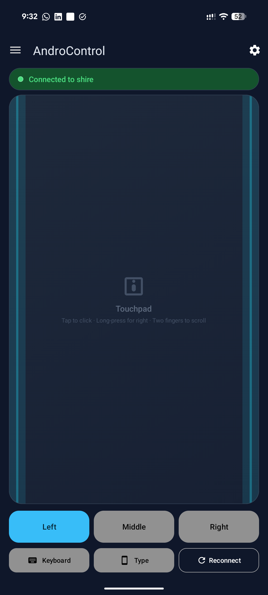
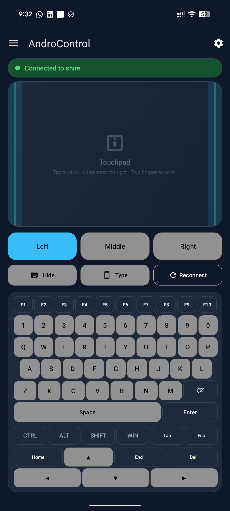
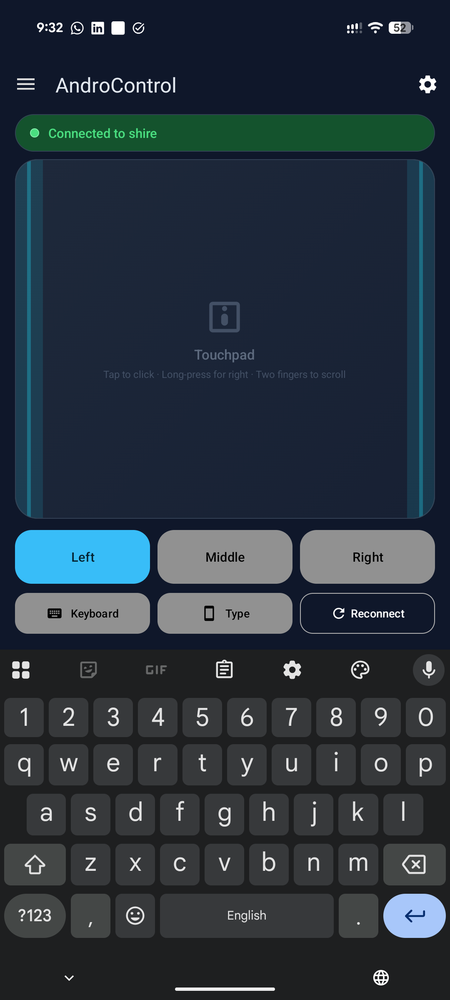
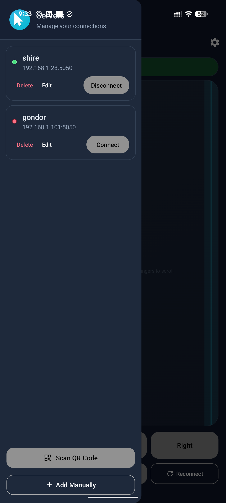
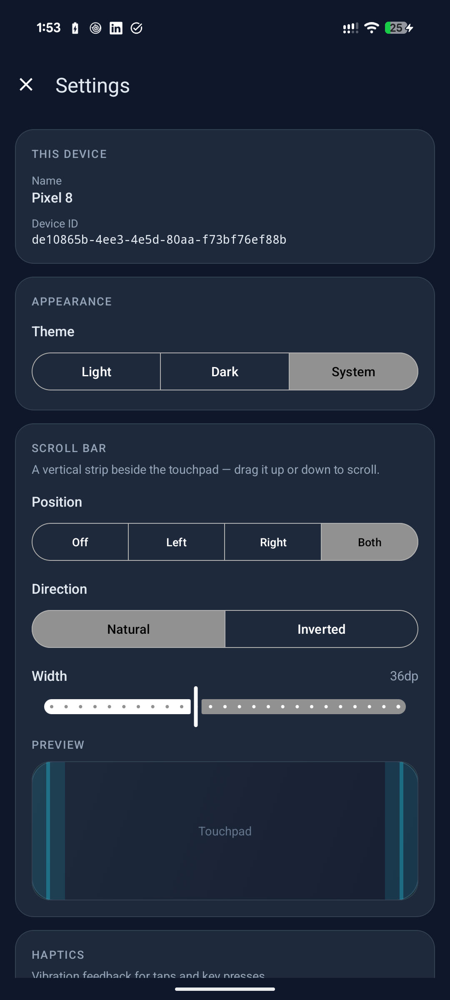
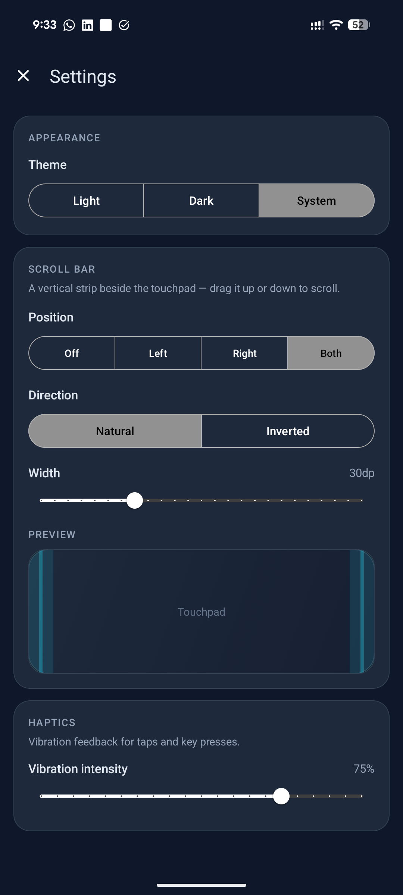

# AndroControl

AndroControl is a secure remote control application that allows you to control your Linux system's mouse and keyboard from your Android smartphone.

<p align="center">
  
</p>

## Features

- **Mouse Control**: Move cursor, left/right/middle click, double-click, drag, and scroll
- **Keyboard Control**: Full QWERTY keyboard with modifier keys (Ctrl, Alt, Shift, Super/Win)
- **Special Keys**: Function keys (F1-F12), navigation keys, Tab, Escape, etc.
- **Key Combos**: Support for keyboard shortcuts like Ctrl+C, Alt+Tab, etc.
- **Mutual TLS**: All communication is encrypted with TLS 1.2/1.3, and each device authenticates with its own client certificate (no shared or copyable token)
- **Certificate Pinning**: QR-paired servers are pinned from the QR's fingerprint (no trust-on-first-use window); manual setup falls back to fail-closed TOFU
- **Pairing & Revocation**: A one-time enrollment token pairs a new device; devices can be revoked individually from the server
- **Single-session control**: Only one device controls the host at a time; other devices are refused without disturbing the active session
- **QR Code Setup**: Scan a QR code from the server for easy connection setup
- **Multiple Servers**: Save and manage multiple server configurations
- **Haptic Feedback**: Configurable vibration feedback for button presses
- **Heartbeat**: Connection health monitoring with automatic reconnection

## Screenshots

<table>
  <tr>
    <td align="center"><br><sub>Touchpad &amp; controls</sub></td>
    <td align="center"><br><sub>On-screen keyboard</sub></td>
    <td align="center"><br><sub>System keyboard (Type)</sub></td>
  </tr>
  <tr>
    <td align="center"><br><sub>Server management</sub></td>
    <td align="center"><br><sub>Settings &middot; device &amp; theme</sub></td>
    <td align="center"><br><sub>Settings &middot; scroll bar &amp; haptics</sub></td>
  </tr>
</table>

## Architecture

The solution follows a client-server architecture:

- **Backend (Go)**: A lightweight server running on the target Linux system that receives control signals over TLS-encrypted TCP and executes them using uinput
- **Frontend (Android)**: A Material Design app that sends mouse and keyboard inputs to the server

## Requirements

### Server (Linux)
- Linux system with uinput kernel module
- Go 1.21+ (for building from source)

### Client (Android)
- Android 6.0 (API 23) or higher
- Camera permission (for QR code scanning)
- Network access to the server

## Installation

### Setting up the Server

1. **Install uinput kernel module**:
   ```bash
   sudo modprobe -i uinput
   ```
   To load on boot, add `uinput` to `/etc/modules`.

2. **Build and run the server**:
   ```bash
   cd Backend-GO
   go build -o AndroControl
   ./AndroControl
   ```

3. **First run**: The server will:
   - Generate TLS certificates (stored in `certs/`)
   - Generate an **enrollment (pairing) token** (stored in `auth_token`)
   - Display a QR code for easy mobile setup
   - Start listening on port 5050

#### Command-line options

```
./AndroControl [flags]

  -addr string         Bind address (default "0.0.0.0"; use 127.0.0.1 for loopback only)
  -port int            TCP port to listen on (default 5050)
  -data-dir string     Directory with certs/, auth_token, devices.json (default: current dir)
  -log-level string    Log verbosity: debug, info, warn, error (default "info")
  -show-qr             Reprint the pairing QR (token + cert fingerprint) and exit
  -list-devices        List paired devices and exit
  -revoke <id|name>    Revoke a paired device by ID or name, then exit
  -revoke-all          Revoke all paired devices, then exit
  -rename <id> -name <n>  Rename a device, then exit
  -prune-inactive <days>  Remove devices not seen in N days, then exit
  -cleanup             Remove revoked devices from the registry, then exit
```

The server stops cleanly on `Ctrl+C` / `SIGTERM`, releasing the virtual input devices.

### Setting up the Android App

1. Build the APK from source or download a release
2. Install on your Android device
3. **Pair via QR code** (recommended):
   - Open the app and tap the QR scanner icon
   - Scan the QR code displayed by the server (or reprint it with `androcontrol-ctl qr`)
   - The app pins the server's certificate from the QR and pairs automatically
4. **Or pair manually**:
   - Add a new server with IP, port, and the pairing token
   - Verify the certificate fingerprint shown on first connection (trust-on-first-use)

On first connection the app presents the pairing token once and the server records this
device's **client-certificate fingerprint**; the pairing token is then discarded on the
phone. Afterwards the device is recognized by its certificate (mutual TLS) and can be
revoked independently from the server.

### Managing paired devices

**When running as a service, use the `androcontrol-ctl` helper** — it runs the
command as the service user against the right data directory and reloads the
service for you:

```bash
sudo androcontrol-ctl qr                     # reprint the pairing QR (to add a new device)
sudo androcontrol-ctl regen-token            # rotate the enrollment token + reprint the QR
sudo androcontrol-ctl list                   # list devices (id, name, status, last seen, IP)
sudo androcontrol-ctl revoke <id-or-name>    # revoke one device (by ID or name)
sudo androcontrol-ctl revoke-all             # revoke every device
sudo androcontrol-ctl rename <id> <name>     # rename a device
sudo androcontrol-ctl prune-inactive <days>  # drop devices not seen in N days
sudo androcontrol-ctl cleanup                # drop revoked devices from the registry
```

To **pair an additional device** after first setup, run `androcontrol-ctl qr` to
reprint the QR (it contains the enrollment token and the server's certificate
fingerprint) and scan it from the app.

The NixOS module installs `androcontrol-ctl` automatically. For the plain systemd
deploy, install it once:
`sudo install -m755 Backend-GO/deploy/androcontrol-ctl /usr/local/bin/`.

Under the hood these map to the binary's own flags, which you can also call
directly (e.g. when running the server by hand):

```bash
./AndroControl -data-dir /var/lib/androcontrol -list-devices
./AndroControl -data-dir /var/lib/androcontrol -revoke <id-or-name>
./AndroControl -data-dir /var/lib/androcontrol -revoke-all
./AndroControl -data-dir /var/lib/androcontrol -cleanup
./AndroControl -data-dir /var/lib/androcontrol -regen-token
```

Device records are stored in `devices.json` (certificate fingerprints only — no private
keys or secrets). Revoked devices are also **pruned automatically once a day** while the
server runs.

> Why a helper? Admin commands edit `devices.json` on disk while the running
> server holds the registry in memory. `androcontrol-ctl` reloads the service
> (sends `SIGHUP`) so the change applies without a restart — and on reload the
> server **immediately drops any live connection** belonging to a revoked
> device. Doing it by hand is equivalent to: run the flag as the service user,
> then `sudo systemctl reload androcontrol`.

### Connect/disconnect notifications
Run a command whenever a device connects or disconnects by passing `-on-event` to the
server (or setting `services.androcontrol.onEvent` in the NixOS module). Event details
are passed in environment variables — never interpolated into the command — so a device
name can't inject shell:

| Variable | Value |
| --- | --- |
| `ANDROCONTROL_EVENT` | `connect` or `disconnect` |
| `ANDROCONTROL_DEVICE_ID` | the paired device's id |
| `ANDROCONTROL_DEVICE_NAME` | the device's display name |
| `ANDROCONTROL_IP` | the client IP address |
| `ANDROCONTROL_DURATION` | session length in seconds (disconnect only) |

```bash
./AndroControl -on-event 'notify-send "AndroControl" "$ANDROCONTROL_EVENT: $ANDROCONTROL_DEVICE_NAME ($ANDROCONTROL_IP)"'
```

The command runs asynchronously with a 10-second timeout; failures are logged and never
affect the session. Note: delivering **desktop** notifications from a sandboxed system
service needs access to your graphical session bus (`DISPLAY`/`DBUS_SESSION_BUS_ADDRESS`),
which may require relaxing the unit sandbox or targeting the user bus.

## Usage

### Mouse Controls
- **Swipe** on the touchpad to move the cursor
- **Tap** for left click
- **Long press** for right click
- **Double tap** for double click
- **Two-finger swipe** for scrolling
- Use the **L/M/R buttons** for click and drag operations

### Keyboard Controls
- Tap the **Keyboard** button to show the keyboard panel
- Use the on-screen QWERTY keyboard or the native keyboard
- Toggle **Ctrl/Alt/Shift/Win** modifiers for key combinations
- Special keys: Tab, Esc, Arrow keys, Home, End, Delete, F1-F12

### Background operation
While connected, the app runs a foreground service (with an ongoing notification and
a "Disconnect" action) and holds a partial wake lock, so the session stays alive when
the app is backgrounded or the screen is off. Allow the notification permission when
prompted so the status is visible.

### This device / unpairing
- **Settings → This device** shows this install's name and device ID.
- To unpair, open a server's **Edit** dialog and tap **Unpair**. If you're connected,
  the server revokes this device's certificate immediately. If you're offline, connect
  first (or revoke the device on the server) — the certificate identity is shared
  across servers, so there's nothing per-server to remove locally.

## Security

### TLS Encryption
All communication between the app and server is encrypted using TLS 1.2 or 1.3. The server generates a self-signed certificate on first run.

### Certificate Pinning
The QR code embeds the server's SHA-256 certificate fingerprint, so a **QR-paired
server is pinned immediately** — no trust-on-first-use window. For manual setup the
app falls back to TOFU: it shows the fingerprint for you to verify, saves it, and
verifies it on every later connection (warning on change). Pinning is **fail-closed**
— the app never silently trusts an unverified certificate.

### Brute-force protection
Repeated failed pairing/authentication attempts from an IP are rate-limited: after
5 failures within 5 minutes the IP is locked out for 15 minutes. All pairing and
authentication events are written to the log with an `[AUDIT]` prefix.

### Per-device Authentication (mutual TLS)
Each device has its own **client certificate** whose private key is generated in the
Android Keystore (non-exportable, hardware-backed where available). The device proves
its identity during the **mutual-TLS handshake** — no bearer token is sent or stored
that could be copied or replayed.

- **Pairing:** the server generates a long-lived **enrollment (pairing) token** on
  first run. To pair, a device (presenting its client cert) sends the enrollment token
  once; the server records the device's certificate **fingerprint** in `devices.json`.
- **Subsequent connections:** the server recognizes the device by its certificate at
  the TLS handshake — pairing/tokens are not involved again.
- Devices can be **revoked individually** (`-revoke <id>`); the cert is then rejected
  at the handshake and any live connection is dropped.
- The registry stores certificate **fingerprints only** (the cert is public; the
  private key never leaves the device), plus last-seen time/IP for auditing.

Anyone with the enrollment token can pair a new device, so treat the QR code / token
as a secret and rotate it with `androcontrol-ctl regen-token` (a running service picks
up the new token automatically; existing paired devices keep working) if it leaks.

### Connection lifecycle
The authenticated TLS connection is the trust boundary. Idle connections are closed
by a server-side read deadline, and the client sends periodic heartbeats (PING/PONG)
to keep an active connection alive and detect drops.

### Single active session
The server allows **only one active control session at a time**. While a device is
connected, a connection attempt from a **different** device is rejected (`AUTH:BUSY`)
without disturbing the active session. The **same** device reconnecting (e.g. after a
network drop or app restart) reclaims its own slot, displacing the stale connection.

For the full trust model, hardening controls and the vulnerability-disclosure process,
see [SECURITY.md](SECURITY.md).

## Network Configuration

- Default port: **5050**
- Protocol: **TCP with TLS**
- Both devices must be on the same network (or have appropriate routing)
- Firewall must allow TCP traffic on the configured port

> **Security note:** anyone who can reach the port and holds a valid credential (a
> paired client certificate, or the enrollment token to pair one) gets full
> keyboard/mouse control of the machine. Run AndroControl only on trusted networks,
> bind to `127.0.0.1` and use a VPN/SSH tunnel for remote access, or restrict the port
> with a firewall. Avoid exposing it directly to the internet.

## Running as a service (systemd)

Sample units are in [`Backend-GO/deploy/`](Backend-GO/deploy/):

```bash
# 1. Load uinput at boot and grant the 'input' group access to it
sudo cp Backend-GO/deploy/uinput.conf      /etc/modules-load.d/uinput.conf
sudo cp Backend-GO/deploy/99-uinput.rules  /etc/udev/rules.d/99-uinput.rules
sudo modprobe uinput
sudo udevadm control --reload-rules && sudo udevadm trigger

# 2. Create a dedicated user and install the binary + helper + data dir
sudo useradd --system --no-create-home --groups input androcontrol
sudo install -Dm755 Backend-GO/AndroControl /usr/local/bin/AndroControl
sudo install -m755 Backend-GO/deploy/androcontrol-ctl /usr/local/bin/androcontrol-ctl
sudo install -d -o androcontrol -g androcontrol /var/lib/androcontrol

# 3. Install and start the service
sudo cp Backend-GO/deploy/androcontrol.service /etc/systemd/system/
sudo systemctl daemon-reload
sudo systemctl enable --now androcontrol
sudo journalctl -u androcontrol -f   # view the QR code / token / fingerprint
```

## Building from Source

### Backend
```bash
cd Backend-GO
go build -o AndroControl
```

### Frontend
```bash
cd Frontend
./gradlew assembleDebug
```

The APK will be in `Frontend/app/build/outputs/apk/debug/`.

## Project Structure

```
AndroControl/
├── Backend-GO/           # Go server
│   ├── main.go          # Entry point, handshake, command loop, uinput
│   ├── auth.go          # Enrollment-token authentication
│   ├── devices.go       # Per-device registry (pairing/revocation)
│   ├── auththrottle.go  # Failed-attempt lockout
│   ├── logging.go       # Leveled logging
│   ├── tls.go           # TLS certificate handling
│   ├── protocol.go      # Command protocol
│   ├── validation.go    # Input validation
│   ├── ratelimit.go     # Rate limiting
│   ├── qrcode.go        # QR code generation
│   ├── connmanager.go   # Connection management
│   └── deploy/          # systemd unit, udev rule, androcontrol-ctl
├── Frontend/             # Android app
│   └── app/src/main/java/com/aranaj/androcontrol/
│       ├── MainActivity.java      # Main UI and controls
│       ├── ConnectionService.java # Foreground service (background persistence)
│       ├── SettingsActivity.java  # Settings + device info
│       ├── SettingsManager.java   # Preferences + client device id
│       ├── TlsHelper.java         # TLS/TOFU implementation
│       ├── SecureStorage.java     # Encrypted storage
│       ├── Protocol.java          # Communication protocol (pair/auth/unpair)
│       ├── HeartbeatManager.java  # Connection health
│       ├── Server.java            # Server model
│       ├── ServerManager.java     # Server persistence
│       └── QRScannerActivity.java # QR code scanning
└── Assets/               # Screenshots and resources
```

## Troubleshooting

### Server won't start
- Ensure uinput module is loaded: `lsmod | grep uinput`
- Check if port 5050 is available: `ss -tlnp | grep 5050`
- Run with sudo if uinput permissions are insufficient

### App can't connect
- Verify both devices are on the same network
- Check firewall settings on the server
- Ensure the correct IP address and port are configured

### Certificate errors
- If you regenerated server certificates, clear the saved fingerprint in the app
- Go to server settings and delete/re-add the server

### Input not working
- Ensure the server has permissions to use uinput
- Check server logs for error messages

## Versioning

- **App:** `versionName` in `Frontend/app/build.gradle.kts`.
- **Wire protocol:** `ProtocolVersion` in `Backend-GO/protocol.go` (client and server
  negotiate compatibility on connect).
- **Releases** are tagged `vX.Y.Z`; pushing a tag builds and publishes the Linux
  server binaries (see `.github/workflows/release.yml`).

Keep the app version and protocol version in step when changing the wire format.
Notable changes are recorded in [CHANGELOG.md](CHANGELOG.md).

## Privacy

AndroControl is self-hosted and collects no data for the developers. See
[PRIVACY.md](PRIVACY.md) for the full policy (required for the Play Store listing).

## License

See [LICENSE](LICENSE) file.

## Disclaimer

This software is provided as-is. Use at your own risk. The authors are not responsible for any damages or misuse of this application.
